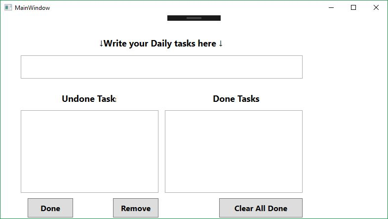

# ToDoList
This project is "To Do List" 
You can write your daily tasks here , and make changes such as "Complete task", or "delete some tasks and so on..."
Here's screenshot of this application

in the upper textbox you should input you tasks than press ENTER
after that your task will be shown in UndoneTasks section
you can remove some tasks if there was a misstakes
you can mark tasks with done and after that, task will trasfer to the DoneTasks section
in the end you can remove all done tasks if you want by pressing Clear All Done button
